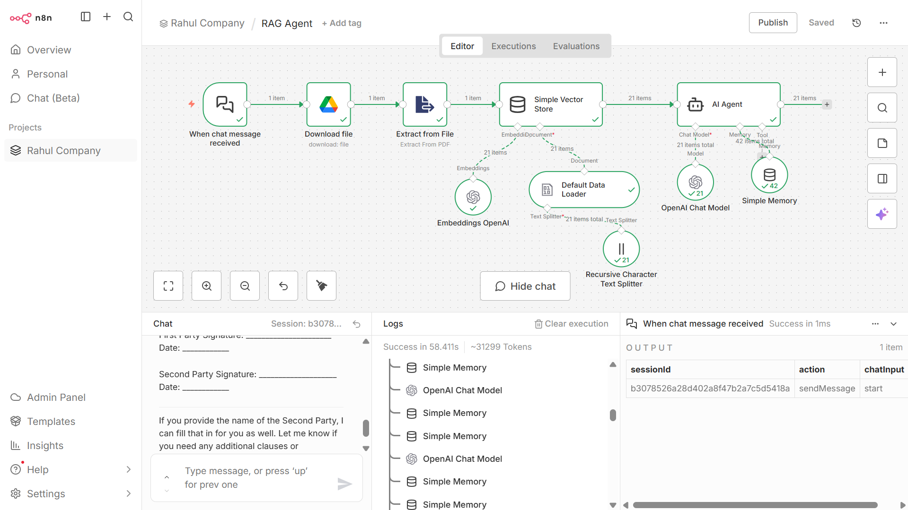

# 🤖 Strategic AI Analyst: Enterprise RAG Agent
> **Automating high-level document intelligence using n8n and GPT-4.**

---

### 📊 Project Architecture

### 💡 The Problem & Solution
* **The Challenge**: Manual review of enterprise agreements (like NDAs or Service Contracts) is time-consuming and prone to human oversight regarding legal risks.
* **The Solution**: A **Retrieval-Augmented Generation (RAG)** agent that uses a vectorized document store to provide instant strategic analysis.

### 🛠️ Technical Implementation
| Component | Technology | Role |
| :--- | :--- | :--- |
| **Orchestration** | n8n | Logic Flow & Node Management |
| **LLM** | OpenAI GPT-4 | Strategic Reasoning |
| **Vector DB** | Simple Vector Store | Contextual Document Memory |
| **Embeddings** | OpenAI Embeddings | Data Vectorization |

---

### 🚀 Key Capabilities
1. **Executive Summary**: Instant 30,000-ft view of any agreement.
2. **Risk Identification**: Automated detection of missing clauses, vague payment terms, or duration gaps.
3. **Actionable Recommendations**: Strategic advice based on a Senior Consultant persona.

Processing: The system splits text into chunks using the Recursive Character Text Splitter and stores them in a vector database.

Analysis: The AI Agent queries the database and applies strategic logic to the retrieved content.

Delivery: A structured report is provided back to the user in real-time.

### 📥 How to Use This Workflow
1. Download the `RAG Agent (1).json` file from this repository.
2. Open your **n8n** instance.
3. Create a new workflow and select **Import from File**.
4. Add your **OpenAI API Key** to the Chat Model and Embeddings nodes to activate the Strategic Analyst.
